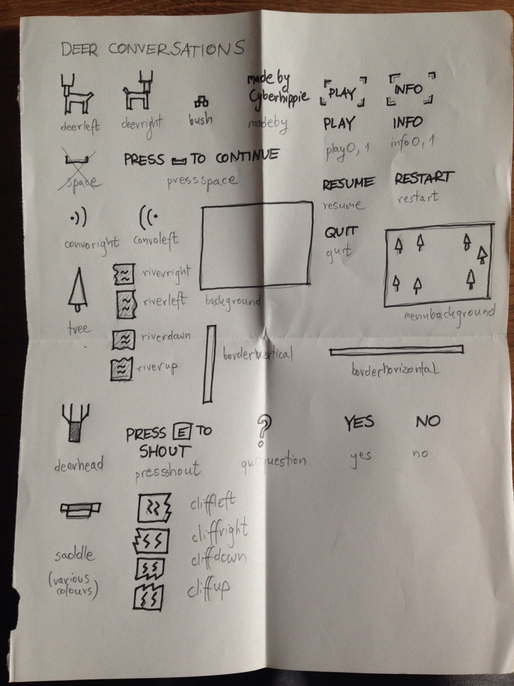
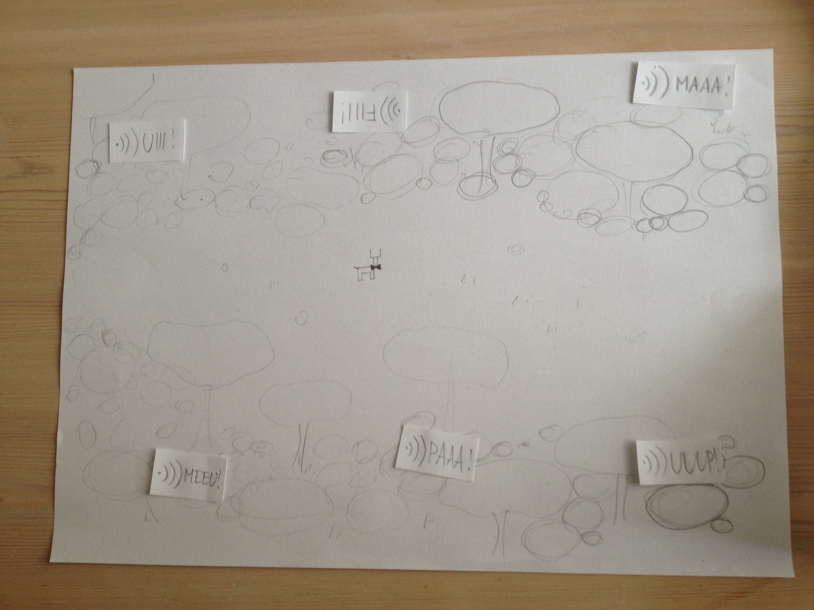

<a name="intro"></a>
# DEER CONVERSATIONS - Narrative Versus Game
Deer Conversations
Narrative Versus Game

Deer Conversations is a 2-4 versus game where using your chat-wits is essential for maintaining your rhetoric. Gain the right to enter Deer Gentleman's Club and claim the prize from Schopenhauer himself.








.pdf)

.pdf)
.pdf)


Description.


Description.


### Table of Contents
1. [Introduction.](#intro)
2. [Features.](#features)
3. [Issues.](#issues)
4. [Icebox.](#icebox)
5. [Installation and usage guide.](#install)
6. [Contributing.](#contribute)
7. [License.](#license)
8. [Credits.](#credits)
9. [Commit Glyphs.](#glyphs)

<a name="features"></a>
### Features
+ Feature_01
+ Feature_02
+ Feature_03

<a name="issues"></a>
### Issues
+ Issue_01
+ Issue_02
+ Issue_03

<a name="icebox"></a>
### Icebox
+ Idea_01
+ Idea_02
+ Idea_03

<a name="install"></a>
### Installation and Usage Guide
Include basic necessary components. Gifs if required.
```
1. 
2. 
3. 
```

<a name="contribute"></a>
### Contributing
Insert project contribution rules if allowed.

<a name="license"></a>
### License
Insert project licensing options if there are any.

<a name="credits"></a>
### Credits
Insert project creator entities, contributors and their respective presence links.

<a name="glyphs"></a>
### Commit Glyphs

+ ☰ Code structure and formatting
+ ▲ Performance improvements
+ ⨯ File deletion
+ ∗ Bugfix
+ ⬡ New Feature
+ ⎔ Documentation
+ ❑ UI design
+ ⚑ Release
